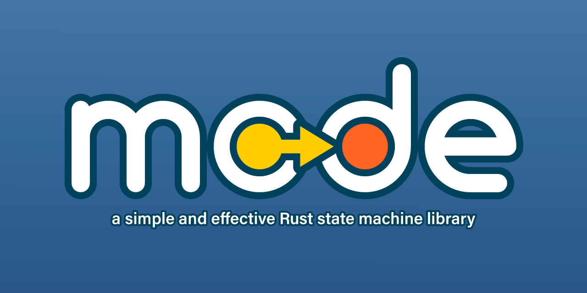

[](https://travis-ci.com/andrewtc/mode)
[](https://gitter.im/mode-rs/community?utm_source=badge&utm_medium=badge&utm_campaign=pr-badge)

A simple and effective state machine library, written in in idiomatic, 100% safe, stable Rust code.

## Features

This library provides three main types, `Automaton`, `Mode`, and `Family`, that facilitate the creation of finite state
machines. An `Automaton` can be used to quickly create a state machine over a `Family` of states, represented by objects
that implement the `Mode` trait. The `Automaton` allows function calls to be dispatched to the current `Mode` via
`Deref` coercion, and a flexible transition system provides a way to swap to a different `Mode` in the state machine,
with the option to steal state from the previous `Mode`. This can help prevent spikes in memory usage when transitioning
between `Mode`s that contain large amounts of data.

## Why use `mode`?

 - **Flexibility:** Create state machines that switch between `enum` values in-place, or organize each state into a
   separate `struct`. Create states with explicit lifetimes and references, or which copy around everything they need.
   This library imposes very few restrictions on how you write and organize your code.
 - **Well-documented code:** All public types have detailed documentation and examples, so getting up to speed is easy.
 - **Easy-to-digest internals:** Barring examples, the whole library clocks in at just over 1,000 lines of pure Rust, so
   digging into the internals to figure out how it works does not require a huge time investment. No macro magic, no
   auto-`impl`s. Just `trait`s, `struct`s, and generics.

## Releases

See the full list of releases on [GitHub](https://github.com/andrewtc/mode/releases).

## Upgrading to version `0.4`

A lot has been streamlined in version `0.4`, in an effort to make `mode` even easier to understand and use. If you're
interested in upgrading your project from version `0.3` to `0.4` of `mode`, please see
[UPGRADING-v0.4.md](UPGRADING-v0.4.md) for a step-by-step guide.

## Documentation

Please see [docs.rs](https://docs.rs/mode) for detailed documentation.

## Example

```rust
use mode::{Automaton, Family, Mode};

// This meta-struct represents a group of all Modes that can be used with the same Automaton, i.e. all states in the
// same state machine. By implementing Family, we can specify the common interface that will be exposed for all states
// (type Base) and how the current state will be stored in the Automaton (type Mode). The important thing to note is
// that this struct will never be instantiated. It only exists to group a set of states (Modes) together.
// 
struct ActivityFamily;

impl Family for ActivityFamily {
    // This is the public interface that will be exposed by the Automaton for all Modes in this Family.
    type Base = dyn Activity;

    // This is the type that will be stored in the Automaton and passed into the Automaton::next() function.
    type Mode = Box<dyn Activity>;
}

// This trait defines a common interface for all Modes in ActivityFamily.
//
trait Activity : Mode<Family = ActivityFamily> {
    fn update(self : Box<Self>) -> Box<dyn Activity>;
}

// Each state in the state machine implements both Activity (the Base type) and Mode.
//
struct Working {
    pub hours_worked : u32,
}

impl Mode for Working {
    type Family = ActivityFamily;
}

impl Activity for Working {
    // This function updates the Mode and allows it to swap another one in as current, when ready.
    //
    fn update(mut self : Box<Self>) -> Box<dyn Activity> {
        println!("Work, work, work...");
        self.hours_worked += 1;

        if self.hours_worked == 4 || self.hours_worked >= 8 {
            // To swap to another Mode, we can return a new, boxed Mode with the same signature as this one. Note that
            // because this function consumes the input Box<Self>, we can freely move state out of this Mode and into
            // the new one that will be swapped in.
            println!("Time for {}!", if self.hours_worked == 4 { "lunch" } else { "dinner" });
            Box::new(Eating { hours_worked: self.hours_worked, calories_consumed: 0 })
        }
        else { self } // Returning self means that this Mode should remain current.
    }
}

struct Eating {
    pub hours_worked : u32,
    pub calories_consumed : u32,
}

impl Mode for Eating {
    type Family = ActivityFamily;
}

impl Activity for Eating {
    fn update(mut self : Box<Self>) -> Box<dyn Activity> {
        println!("Yum!");
        self.calories_consumed += 100;

        if self.calories_consumed >= 500 {
            if self.hours_worked >= 8 {
                println!("Time for bed!");
                Box::new(Sleeping { hours_rested: 0 })
            }
            else {
                println!("Time to go back to work!");
                Box::new(Working { hours_worked: self.hours_worked })
            }
        }
        else { self }
    }
}

struct Sleeping {
    pub hours_rested : u32,
}

impl Mode for Sleeping {
    type Family = ActivityFamily;
}

impl Activity for Sleeping {
    fn update(mut self : Box<Self>) -> Box<dyn Activity> {
        println!("ZzZzZzZz...");
        self.hours_rested += 1;

        if self.hours_rested >= 8 {
            println!("Time for breakfast!");
            Box::new(Eating { hours_worked: 0, calories_consumed: 0 })
        }
        else { self }
    }
}

fn main() {
    let mut person = ActivityFamily::automaton_with_mode(Box::new(Working { hours_worked: 0 }));
    
    for _age in 18..100 {
        // Update the current Mode and/or transition to another Mode, when the current Mode requests it.
        Automaton::next(&mut person, |current_mode| current_mode.update());
    }
}
```

# License

Licensed under either of

 * Apache License, Version 2.0 ([LICENSE-APACHE](https://github.com/andrewtc/mode/blob/master/LICENSE-APACHE) or 
   http://www.apache.org/licenses/LICENSE-2.0)
 * MIT license ([LICENSE-MIT](https://github.com/andrewtc/mode/blob/master/LICENSE-MIT) or
   http://opensource.org/licenses/MIT)

at your option.

## Contributing

Unless you explicitly state otherwise, any contribution intentionally submitted for inclusion in the work by you, as
defined in the Apache-2.0 license, shall be dual licensed as above, without any additional terms or conditions.

If you find bugs, please feel free to open an issue on [GitHub](https://github.com/andrewtc/mode/issues)! Otherwise, if
you would like to propose changes to this library, feel free to send me a pull request or message me on the `mode`
[Gitter channel](https://gitter.im/mode-rs/community?utm_source=share-link&utm_medium=link&utm_campaign=share-link).
I'll try to respond to these requests as quickly as I can.